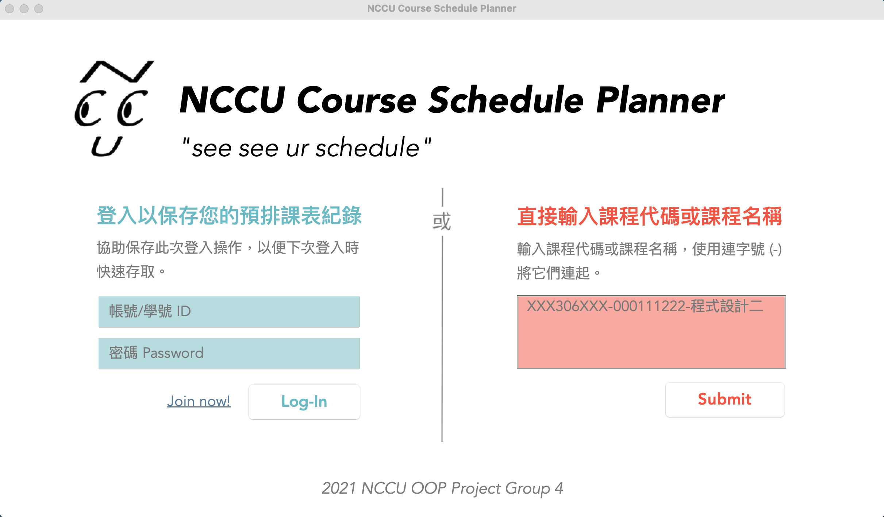
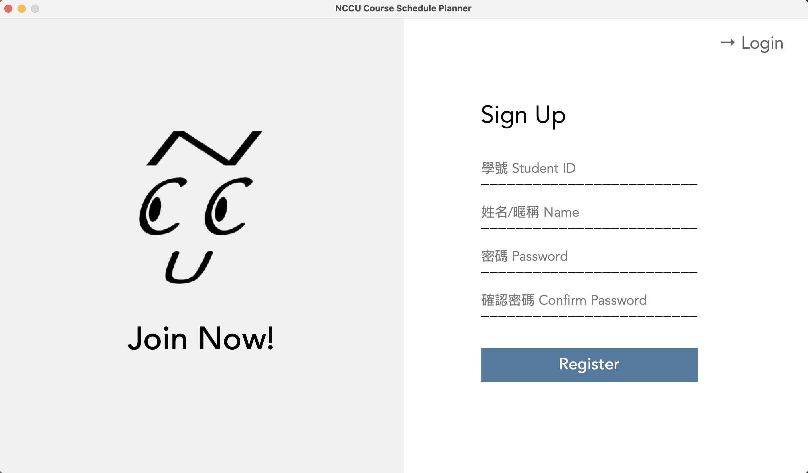
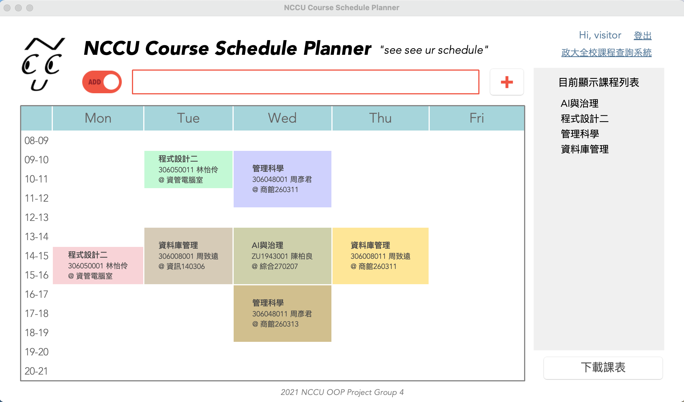
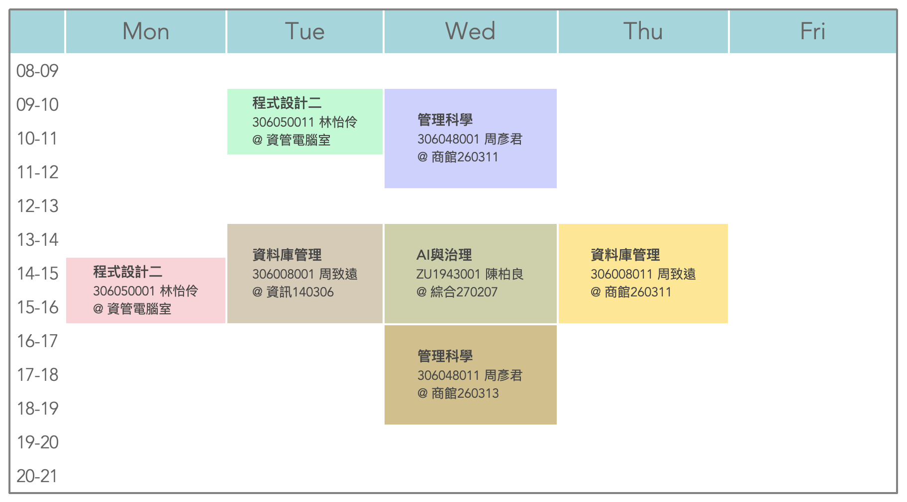
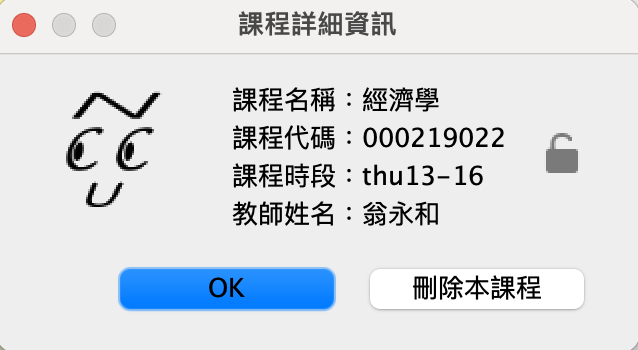
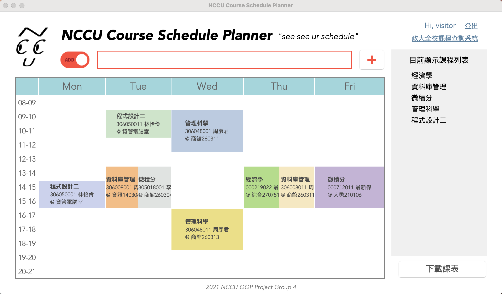
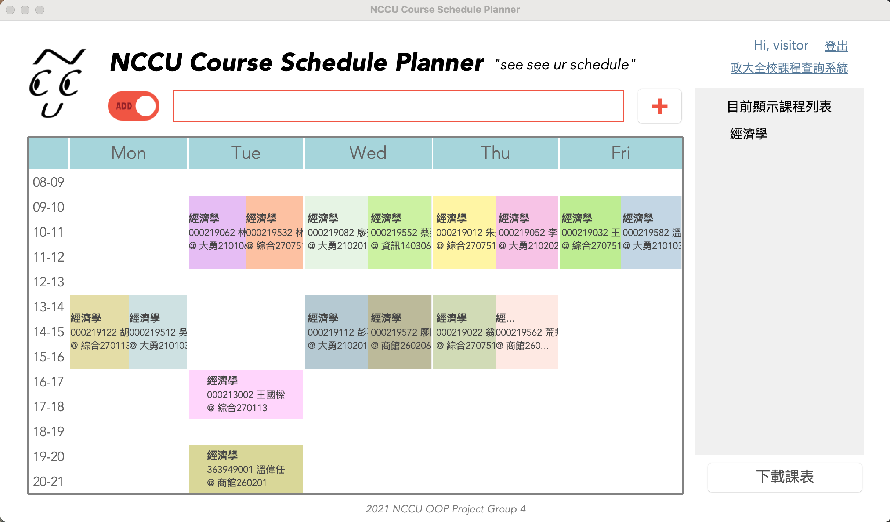

# NCCU Course Schedule Planner  
A desktop application for NCCU students to visualize their course schedule  
[View on GitHub](https://github.com/plack537/CourseSchedulePlanner)  
## Operating System 
macOS BigSur 11.4  
openjdk version 11.0.9
## Login Page  
  
There are two ways to access the service:  
* **User Login (Blue)**  
The login mode allows user to save their schedule and allows them to access to the same page the next time they login. New user may create an accounts by clicking the "Join now!" label, which leads the user to the register page.
* **Visitor (Red)**  
The visitor mode allows user to simply enter course name and course ID at the login page. Yet, record will be deleted when logout if the user uses the visitor mode to access the service. The system supports entering multiple courses at the same time by linking the courses name/ID with hyphens. 
## Register Page  
  
## Schedule Page  
  
The main functions of the system includes:  
* **Course Input Box**  
The toggle button controls the add/drop mode of the course, select the mode and enter the courses name/ID, then, click the button. The change listener of the toggle button not only controls the appearance of the border and button, but also changes the action listener of the add/drop button (the one with plus/minus sign).   
**_Make sure the course input box is cleared before you switch mode._**  
  
  
This function also supports entering multiple courses at the same time by linking the courses name/ID with hyphens. The system will first split the input string by hyphens and save it to an arraylist, after that, try-catch will be used inside a loop to check whether the user entered a name or an ID. 
    ```
    try {
        Integer.parseInt(inp.substring(6));
        id = true;
    } catch (NumberFormatException|IndexOutOfBoundsException e) {
        id = false;
    }
    ```
* **Timetable**  
The timetable is designed based on most students' need. Therefore, weekend and sessions that are too late or too early are ignored in the timetable for easier reading.  
  
Every course block shown in the timetable is a button. A random low saturation color will be assigned to every course block, ensuring the words on the buttons can be clearly seen. When the user click on it, a message box will popup and show the information about the course. On the message box, there is a lock toggle button that allows user to lock the selected course. If a course is locked, it can no longer be deleted by any method unless the user unlock it.  
  
A feature of the system is that it can show the timetable clash between multiple courses. When there are n courses in the same session, the session will be split into n parts.  
  
As mentioned, user may enter course name/ID to add/drop courses. Since course name is not a unique value and ID is, when the user enter a course name, all sessions of that course will be shown while entering ID will only show the one specific session.
  
* **Courses Currently Displayed**  
The grey box on the right side of the window is a list of the courses shown on the timetable. Make it more covenient for users to check if all the courses needed is on the timetable.  

Other additional functions:
* **Greetings**  
Shows "Hi, 'username'" when user login.
* **Logout**  
Clear visitor's record
* **Link to the official NCCU course inquiry system**  
Students can find more details on the official website
* **Download Timetable**  
Save a screenshot of the timetable to the user's downloads  
